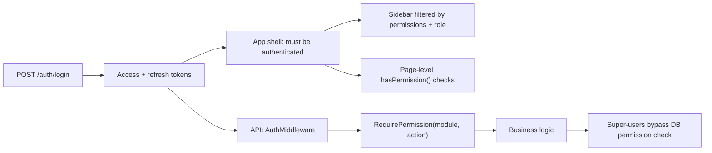
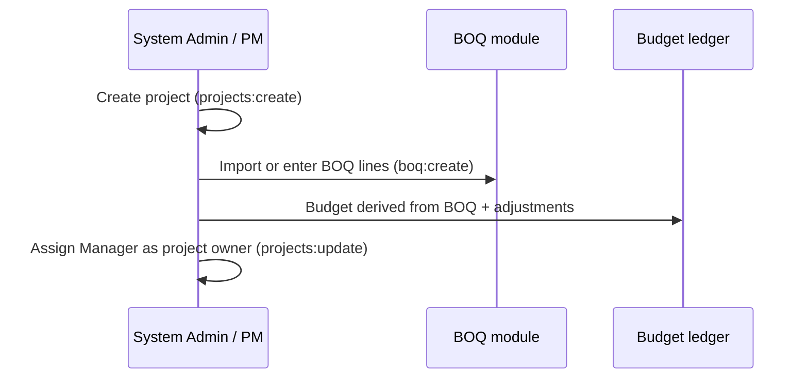
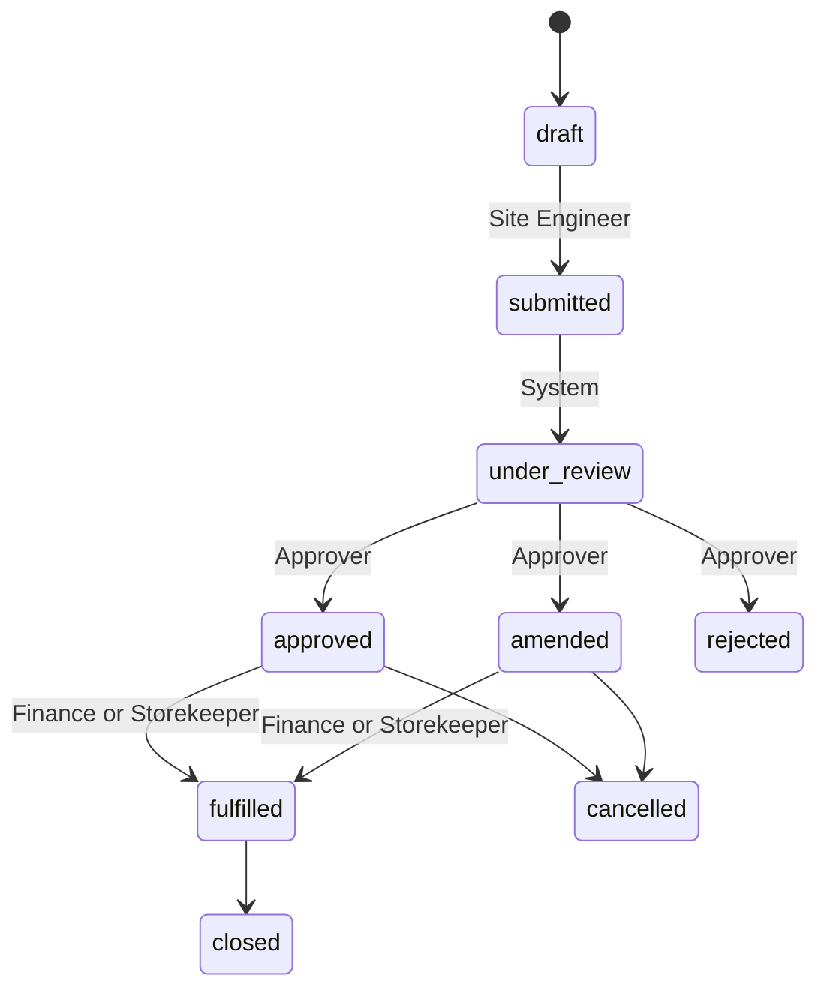
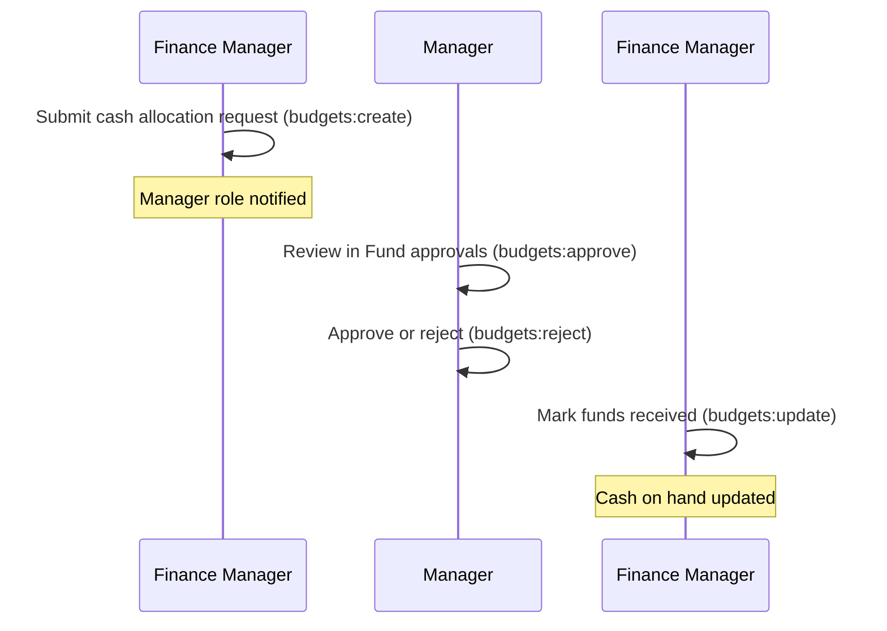
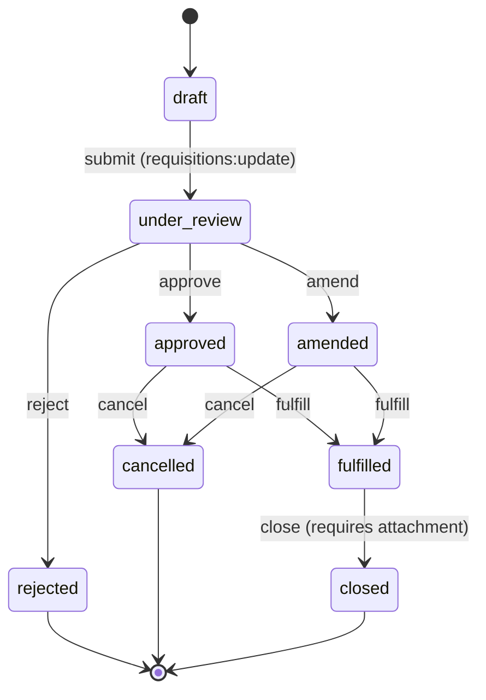
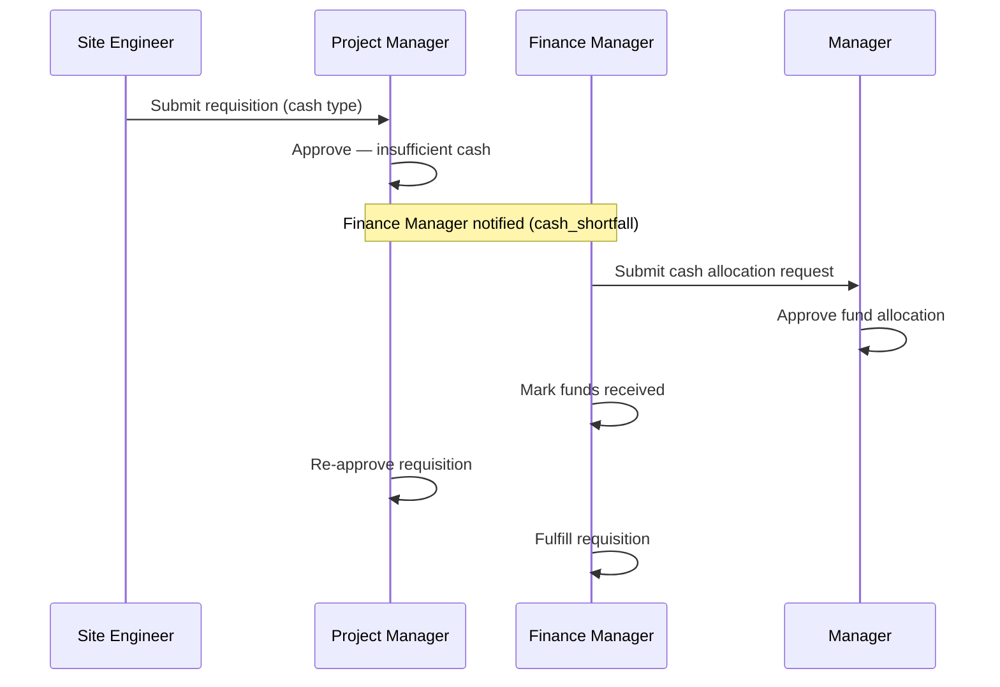
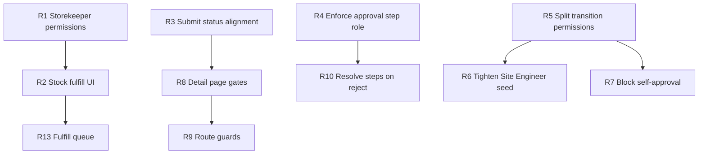

# CRF-ERP — User Roles, Permissions, Flows & Configuration

This document describes who can do what in CRF-ERP, how major workflows move between roles, and where access is enforced or configured.

**Scope today:** single-organization deployment. All users share one database; data is isolated by `project_id`, not by tenant. Multi-tenancy is planned but not implemented (see `MIGRATION_LARAVEL_MULTITENANT.md`).

---

## Table of contents

1. [How access control works](#1-how-access-control-works)
2. [Roles overview](#2-roles-overview)
3. [Permission model](#3-permission-model)
4. [Permission matrix by role](#4-permission-matrix-by-role)
5. [Navigation & UI controls](#5-navigation--ui-controls)
6. [Platform configuration](#6-platform-configuration)
7. [Core user flows](#7-core-user-flows)
8. [Approval workflows](#8-approval-workflows)
9. [Override privileges](#9-override-privileges)
10. [Default accounts](#10-default-accounts)
11. [Environment configuration](#11-environment-configuration)
12. [Key source files](#12-key-source-files)
13. [Deep analysis: Requisitions by role](#13-deep-analysis-requisitions-by-role)
    - [13.8 Known gaps](#138-known-gaps-and-ui-limitations)
    - [13.13 Recommendations](#1313-recommendations)

---

## 1. How access control works

Access is enforced in three layers:

| Layer | What it does | Authoritative? |
|-------|----------------|----------------|
| **API middleware** | JWT validation + `RequirePermission(module, action)` on each route | **Yes** — real enforcement |
| **Service-layer role checks** | Hardcoded role names for overrides (cash shortfall, BOQ override, manual budget adjustment) | **Yes** |
| **Frontend** | Sidebar filtering, conditional buttons, admin page redirects | **UX only** — hides or shows UI; API still blocks unauthorized calls |

### Authentication flow

1. User submits email/password at `/login`.
2. Backend returns JWT access token (default 15 min) and refresh token (default 7 days).
3. Frontend stores session in Zustand + `localStorage` (`crf-auth`).
4. On each app load, `AppShell` calls `/auth/me` to refresh the user profile, including `permissions[]`, `can_manage_platform`, and `can_impersonate`.
5. Unauthenticated users are redirected to `/login`.

### Super-users

These three roles bypass all database permission checks via `IsSuperUser()`:

- **Platform Admin**
- **System Administrator**
- **Managing Director**

They always pass `HasPermission()` regardless of what is stored in the `permissions` table.

---

## 2. Roles overview

There are **13 roles**, seeded at startup from `backend/internal/auth/seed.go`.

| Role | Category | Primary responsibility |
|------|----------|------------------------|
| **Platform Admin** | Platform operator | User management, UI branding, impersonation, full module access |
| **System Administrator** | Super-user | Full ERP access; initial setup account |
| **Managing Director** | Super-user | Executive oversight; unlimited approval authority |
| **Manager** | Restricted ops | Project owner; approves **cash allocation requests**; read-heavy elsewhere |
| **Finance Manager** | Finance | Cash, budgets, expenses, procurement oversight, fulfill requisitions |
| **Accountant** | Finance | Read/reporting on projects, budgets, valuations |
| **Quantity Surveyor** | QS | BOQ, projects, reports, valuations |
| **Procurement Officer** | Operations | Suppliers, POs, quotations, requisitions |
| **Storekeeper** | Operations | Inventory, stock issues |
| **Project Manager** | Operations | Projects, BOQ, requisitions, reports, valuations; approves small requisitions |
| **Site Engineer** | Operations | Creates and submits requisitions |
| **HR Officer** | HR | Payroll and equipment |
| **Auditor** | Compliance | Read-only on operational data; full access to audit module |

### Role-specific notes

**Platform Admin** is not a construction-org role. It operates the SaaS layer:

- `/admin/users` — create users, assign roles, impersonate
- `/admin/settings` — app name, tagline, sidebar labels/visibility
- Cannot perform admin actions while impersonating another user

**Manager** is intentionally constrained:

- Can **update projects** (e.g. assign project owner) but cannot create, amend, or soft-delete records
- **Requisitions: read only** — cannot create, submit, or approve
- Has `budgets:approve` — used for **Fund approvals** (cash allocation requests from finance)
- Typically assigned as `manager_id` on a project

**Managing Director** has a `null` approval threshold (unlimited). Project Manager, Finance Manager, and Accountant are seeded with a 5M TZS threshold on the role record (not yet wired into approval logic).

---

## 3. Permission model

### Modules

`projects`, `boq`, `budgets`, `audit`, `auth`, `requisitions`, `procurement`, `inventory`, `payroll`, `equipment`, `reports`, `valuations`

> **Note:** Finance API routes check the **`budgets`** module, not a separate `finance` module.

### Actions

| Action | Typical use |
|--------|-------------|
| `read` | View lists and detail |
| `create` | Create new records |
| `update` | Edit existing records |
| `approve` | Approve requests (requisitions, cash allocations) |
| `amend` | Approve with quantity/amount changes |
| `reject` | Reject pending items |
| `delete-soft` | Soft-delete records |

### Storage

- `roles` — role name and optional `default_approval_threshold_max`
- `permissions` — `(role_id, module, action)` tuples
- On every backend boot, `syncModulePermissions()` re-applies seed rules so new modules are granted to existing roles

---

## 4. Permission matrix by role

Legend: **All** = all 7 actions on all modules.

| Role | Modules | Restrictions |
|------|---------|--------------|
| **Platform Admin** | All | + platform admin routes, impersonation |
| **System Administrator** | All | Super-user bypass |
| **Managing Director** | All | Super-user bypass |
| **Manager** | projects, boq, budgets, requisitions, reports, valuations | No create/amend/delete-soft; update only on **projects**; requisitions **read only**; has `budgets:approve` |
| **Finance Manager** | projects, boq, budgets, audit, requisitions, procurement, reports, valuations | Full actions on assigned modules |
| **Accountant** | projects, budgets, reports, valuations | Full actions on assigned modules |
| **Quantity Surveyor** | projects, boq, reports, valuations | No approve/amend on payroll/budgets (modules not assigned) |
| **Procurement Officer** | procurement, requisitions, boq | Full actions |
| **Storekeeper** | inventory, boq | Full actions |
| **Project Manager** | projects, boq, requisitions, reports, valuations | Full actions |
| **Site Engineer** | requisitions, boq | Full actions |
| **HR Officer** | payroll, equipment | Full actions |
| **Auditor** | audit, reports, projects, boq, budgets | **Read-only** on projects/boq/budgets/reports; **all actions** on audit |

### API route protection (summary)

| Route group | Permission pattern |
|-------------|-------------------|
| `/projects/*` | `projects:*` per endpoint |
| `/boq/*` | `boq:*` |
| `/budgets/*` | `budgets:*` |
| `/finance/*` | `budgets:*` (cash, expenses, reconciliation) |
| `/requisitions/*` | `requisitions:*` |
| `/procurement/*` | `procurement:*` |
| `/inventory/*` | `inventory:*` |
| `/payroll/*` | `payroll:*` |
| `/equipment/*` | `equipment:*` |
| `/reports/*` | `reports:read` (all report routes) |
| `/valuations/*` | `valuations:*` or `projects:*` for compliance rules |
| `/audit/*` | `audit:read` |
| `/admin/*` | Platform Admin only (no module permission) |
| `/notifications/*` | Authenticated only (no module check) |

---

## 5. Navigation & UI controls

Navigation is defined centrally in `frontend/src/lib/navigation.ts`. An item appears in the sidebar when:

1. The user's role is in the item's `roles` allowlist (if set), **and**
2. The user holds at least one required permission (OR logic)

| Nav item | Route | Permission | Role restriction |
|----------|-------|------------|------------------|
| Dashboard | `/dashboard` | none | — |
| Projects | `/projects` | `projects:read` | — |
| Requisitions | `/requisitions` | `requisitions:read` | — |
| Finance | `/finance` | `budgets:read` | — |
| Expenses | `/finance/expenses` | `budgets:read` | — |
| Fund approvals | `/finance/approvals` | `budgets:approve` | — |
| Procurement | `/procurement` | `procurement:read` | — |
| Inventory | `/inventory` | `inventory:read` | — |
| Payroll | `/payroll` | `payroll:read` | — |
| Equipment | `/equipment` | `equipment:read` | — |
| Reports | `/reports` | `reports:read` | — |
| Audit | `/audit` | `audit:read` | — |
| Users | `/admin/users` | none | **Platform Admin** |
| Platform settings | `/admin/settings` | none | **Platform Admin** |

### Page-level UI gates

| Page | Condition | Effect |
|------|-----------|--------|
| Admin users / settings | `can_manage_platform` | Redirect to dashboard if false |
| Dashboard widgets | `projects:read`, `reports:read` | Show/hide stat cards |
| Requisitions | `requisitions:create`, `approve`, `projects:read` | Create button, approve actions, project filter |
| Finance | `budgets:approve` | Link to Fund approvals |
| Expenses | `budgets:create` | Show expense creation form |
| App header | `can_manage_platform` | Settings shortcut icon |

### Important limitation

There is **no Next.js route middleware**. A user can type a URL directly (e.g. `/finance`). The page may load, but API calls return `403 Forbidden` if permissions are missing. Sidebar visibility is a convenience, not a security boundary.

---

## 6. Platform configuration

### UI settings (Platform Admin)

Stored in `system_settings` under key `ui_settings`. Configurable via **Platform settings** (`/admin/settings`):

| Setting | Description |
|---------|-------------|
| `app_name` | Shown in sidebar header (default: `CRF-ERP`) |
| `app_tagline` | Subtitle under app name (default: `Construct`) |
| `nav_overrides[]` | Per-route: custom label, hide from sidebar |

Nav overrides change labels and visibility for **all users**. They do not grant or revoke permissions — access rules still apply.

### User management (Platform Admin)

Via **Users** (`/admin/users`):

- Create users with name, email, phone, role, password
- Search existing users
- **Impersonate** any non–Platform Admin user (audit log attributes actions to the impersonator)
- Impersonation shows a banner; **Exit impersonation** restores the Platform Admin session

### Project-level configuration

| Setting | Where | Who sets it |
|---------|-------|-------------|
| Project manager (`manager_id`) | Project update | Users with `projects:update` (Manager, PM, super-users, etc.) |
| IPC compliance rules | Project IPCs page | Users with `valuations:create` / `valuations:update` |
| Approval workflow tiers | `approval_workflow_configs` table | Seeded globally; per-project overrides supported in schema |

---

## 7. Core user flows

### 7.1 Project setup

**Typical roles:** System Administrator, Project Manager, Quantity Surveyor (BOQ), Finance Manager (budget adjustments).

**Manager flow:** Open project → review contract, net budget, progress → update project metadata. Cannot create BOQ lines or requisitions.

---

### 7.2 Requisition lifecycle

> **Deep dive:** See [§13 Deep analysis: Requisitions by role](#13-deep-analysis-requisitions-by-role) for per-role capabilities, API permission mapping, gaps, and scenario walkthroughs.

States: `draft` → `submitted` → `under_review` → `approved` / `amended` / `rejected` → `fulfilled` → `closed`

Requisitions are either **project-scoped** (become **direct expenses** on fulfill) or **organization-wide** (become **overhead / indirect expenses** on fulfill).

| Step | Role | Permission | What happens |
|------|------|------------|--------------|
| Create draft | Site Engineer | `requisitions:create` | Scope: project or organization; lines + fulfillment type (cash, stock, supplier) |
| Submit | Site Engineer | `requisitions:update` | Status → `under_review`; approval step created; **Project Manager** notified |
| Approve / amend / reject | PM, Finance Manager, or MD (by amount) | `requisitions:approve` / `amend` / `reject` | Budget reserved on approve (project only); BOQ quantities checked when linked |
| Fulfill (cash) | Finance Manager | `requisitions:update` | Cash deducted from project or organization float; **Expense** recorded (direct vs overhead) |
| Fulfill (stock) | Storekeeper | `requisitions:update` | Stock issued; **Expense** recorded (accounting, no cash float) |
| Fulfill (supplier) | Procurement / Finance | `requisitions:update` | Supplier payment from scoped float; **Expense** recorded |

**Notifications:**

- Submit → all users with **Project Manager** role
- Cash shortfall on approve → **Finance Manager** role

---

### 7.3 Cash allocation (fund request)

When project cash on hand is insufficient, finance requests additional funds from the project owner (Manager).

| Step | Role | Route / permission |
|------|------|-------------------|
| Request funds | Finance Manager | `POST /finance/cash-requests` — `budgets:create` |
| Approve / reject | **Manager** | `/finance/approvals` — `budgets:approve` / `reject` |
| Record receipt | Finance Manager | `budgets:update` |
| View reconciliation | Finance Manager, Accountant, Manager | `budgets:read` |

---

### 7.4 Expenses & overhead

| Action | Role | Permission |
|--------|------|------------|
| Record direct project expense | Finance Manager | `budgets:create` |
| View expenses | Finance Manager, Accountant, Manager | `budgets:read` |
| View company overhead report | Finance Manager, Accountant | `budgets:read` |

Expenses page shows the create form only when `budgets:create` is present.

---

### 7.5 Procurement

| Action | Role |
|--------|------|
| Manage suppliers | Procurement Officer |
| Create quotations and POs | Procurement Officer |
| Record goods receipt (GRN) | Procurement Officer → updates inventory |

Procurement Officer also has full requisition access for supplier-payment fulfillment paths.

---

### 7.6 Inventory

| Action | Role |
|--------|------|
| View stock levels | Storekeeper |
| Receive stock (IN) | Storekeeper, Procurement (via GRN) |
| Issue stock for requisitions | Storekeeper |
| Override negative stock | Finance Manager, Managing Director, System Administrator |

---

### 7.7 Payroll & equipment

| Action | Role |
|--------|------|
| Manage employees, attendance, payroll runs | HR Officer |
| View/post equipment assignments, fuel, maintenance | HR Officer |
| Review payroll (read-only) | Accountant (via `payroll:read` if granted) |

Equipment costs post to project budget when configured.

---

### 7.8 IPCs & compliance deductions

| Action | Role | Permission |
|--------|------|------------|
| Create / manage compliance rule catalog | PM, QS, Finance Manager | `projects:create` / `projects:update` |
| Create IPC (Interim Payment Certificate) | PM, QS, Finance Manager, Accountant | `valuations:create` |
| Edit draft IPC compliance rules | PM, QS, Finance Manager, Accountant | `valuations:update` |
| Certify IPC | Finance Manager / approvers | `valuations:approve` |
| View IPC history | PM, QS, Accountant, Manager | `valuations:read` |

Each project can have multiple IPCs. Under an IPC the user selects **predefined** compliance rules (managed under **Projects → Compliance Rules**) and chooses rate % of the **project contract**, or a fixed amount.

**Net project amount** = Contract amount − Sum of all IPCs’ compliance rule totals.

---

### 7.9 Reports & audit

| Action | Role |
|--------|------|
| Generate project financial reports | Anyone with `reports:read` |
| Schedule report emails | Anyone with `reports:read` (SMTP must be configured) |
| View audit trail | Auditor, Finance Manager, Platform Admin |
| Trace impersonated actions | Platform Admin (audit shows impersonator ID) |

**Auditor** can read operational data but cannot modify projects, BOQ, budgets, or requisitions.

---

### 7.10 Platform Admin walkthrough

1. Log in as `platform@crf.local`
2. **Users** — create accounts for each construction role
3. **Platform settings** — customize branding and hide irrelevant nav items for the deployment
4. **Impersonate** a Site Engineer to verify requisition UX
5. **Audit** — confirm impersonation is attributed correctly
6. **Exit impersonation** before further admin work

---

## 8. Approval workflows

### Requisition amount tiers

Seeded in `approval_workflow_configs` (global defaults):

| Amount (TZS) | Required approver role | Level |
|--------------|------------------------|-------|
| 0 – 500,000 | Project Manager | 1 |
| 500,001 – 5,000,000 | Finance Manager | 2 |
| 5,000,001+ | Managing Director | 3 |

When a requisition is submitted, one approval step is created matching the amount tier.

### Auto-escalation

Pending approval steps older than `APPROVAL_ESCALATION_HOURS` (default **48**) are skipped and escalated to the next level. Configure via environment variable.

### Enforcement caveat

Approval steps record `required_role`, but the transition handler does not currently validate that the actor's role matches the pending step. Enforcement relies on `requisitions:approve` permission and organizational process. Amount-tier routing is informational and used for escalation.

---

## 9. Override privileges

Some actions bypass normal business rules only for specific roles (hardcoded in services, not the permissions table):

| Capability | Allowed roles |
|------------|---------------|
| Manual budget adjustment | Finance Manager, Managing Director, System Administrator |
| Cash / BOQ override on fulfill | Finance Manager, Managing Director, System Administrator |
| BOQ override on requisition approve | Finance Manager, Managing Director, System Administrator |
| Negative stock override | Finance Manager, Managing Director, System Administrator |

These overrides are used when BOQ limits or cash on hand would otherwise block an operation.

---

## 10. Default accounts

### Auth seed (always)

| Email | Password | Role |
|-------|----------|------|
| `admin@crf.local` | `admin123` | System Administrator (created only if no users exist) |
| `platform@crf.local` | `platform123` | Platform Admin |
| `manager@crf.local` | `demo123` | Manager |

### Demo seed (`SEED_DEMO=true`)

| Email | Password | Role |
|-------|----------|------|
| `pm@crf.local` | `demo123` | Project Manager |
| `engineer@crf.local` | `demo123` | Site Engineer |
| `finance@crf.local` | `demo123` | Finance Manager |
| `procurement@crf.local` | `demo123` | Procurement Officer |
| `store@crf.local` | `demo123` | Storekeeper |
| `hr@crf.local` | `demo123` | HR Officer |

See `DEMO_GUIDE.md` for a hands-on tour using these accounts.

---

## 11. Environment configuration

| Variable | Default | Effect on access / flows |
|----------|---------|---------------------------|
| `JWT_SECRET` | (required) | Signs access tokens |
| `JWT_ACCESS_TTL_MINUTES` | `15` | Access token lifetime |
| `JWT_REFRESH_TTL_DAYS` | `7` | Refresh token lifetime |
| `SEED_DEMO` | `true` in `.env.example` | Loads demo projects, users, requisitions |
| `APPROVAL_ESCALATION_HOURS` | `48` | Hours before pending requisition approval escalates |
| `CORS_ORIGIN` | localhost origins | Allowed frontend origins |
| `SMTP_*` | empty | Required for scheduled report email delivery |

---

## 12. Key source files

### Backend

| File | Purpose |
|------|---------|
| `backend/internal/auth/model.go` | Role, User, Permission models; action constants |
| `backend/internal/auth/roles.go` | `IsPlatformAdmin`, `IsSuperUser`, `CanImpersonate` |
| `backend/internal/auth/seed.go` | Role and permission seeding; default users |
| `backend/internal/auth/service.go` | JWT, `HasPermission`, login |
| `backend/internal/auth/admin.go` | User CRUD, impersonation, profile building |
| `backend/internal/auth/settings.go` | UI settings persistence |
| `backend/internal/middleware/auth.go` | JWT middleware, `RequirePermission`, `RequirePlatformAdmin` |
| `backend/internal/approvals/service.go` | Amount-based approval workflow seed and escalation |
| `backend/internal/*/handler.go` | Per-route permission requirements |

### Frontend

| File | Purpose |
|------|---------|
| `frontend/src/lib/permissions.ts` | `hasPermission`, `canAccessNavItem` |
| `frontend/src/lib/navigation.ts` | Sidebar config and filtering |
| `frontend/src/store/auth.ts` | Auth state, impersonation |
| `frontend/src/components/layout/app-shell.tsx` | Auth gate, sidebar, impersonation banner |
| `frontend/src/app/admin/users/page.tsx` | Platform Admin user management |
| `frontend/src/app/admin/settings/page.tsx` | Platform Admin UI settings |

### Related documentation

| File | Contents |
|------|----------|
| `DEMO_GUIDE.md` | Step-by-step demo walkthrough by role |
| `SYSTEM_DOCUMENTATION.md` | System architecture and business rules |
| `MIGRATION_LARAVEL_MULTITENANT.md` | Planned multi-tenant access model |

---

## Quick reference: who does what

| I need to… | Log in as |
|------------|-----------|
| Set up users and branding | Platform Admin |
| Create projects and BOQ | System Admin, Project Manager, QS |
| Request materials on site | Site Engineer |
| Approve a small requisition (≤ 500k) | Project Manager |
| Approve a large requisition (> 5M) | Managing Director |
| Fulfill cash requisition | Finance Manager |
| Issue stock for requisition | Storekeeper |
| Approve fund allocation to project | **Manager** |
| Request fund allocation | Finance Manager |
| Manage suppliers and POs | Procurement Officer |
| Run payroll | HR Officer |
| Review audit trail | Auditor, Platform Admin |
| Impersonate another user | Platform Admin |

---

## 13. Deep analysis: Requisitions by role

This section is a dedicated breakdown of the **requisitions module** — the most cross-cutting workflow in CRF-ERP. It ties together BOQ quantities, budget commitments, cash on hand, inventory, procurement, and multi-tier approval.

Sources: `backend/internal/requisitions/*`, `backend/internal/approvals/*`, `frontend/src/app/requisitions/*`.

---

### 13.1 What a requisition is

A requisition is a **request for materials or money**, either:

- **Project-scoped** (`project_id` set) — fulfilled as a **direct expense** against that project’s cash float / BOQ.
- **Organization-wide** (`project_id` null) — fulfilled as an **overhead (indirect) expense** against organization cash on hand.

| Field | Purpose |
|-------|---------|
| `requisition_no` | Auto-generated unique reference |
| `project_id` | Project for direct spend; `null` = organization / overhead |
| `boq_item_id` | Optional primary BOQ line (project requests only) |
| `requestor_id` | User who created the draft |
| `department` / `department_id` | Cost-centre |
| `requisition_category_id` | Request category (also used as expense `sub_type`) |
| `fulfillment_type` | How the request will be satisfied (see below) |
| `original_amount` | Sum of line items at creation |
| `amended_amount` | Set when approver amends the total |
| `items[]` | Line items: description, qty, unit cost (optional BOQ / inventory links) |

#### Fulfillment types

| Type | Value | Cash impact on approve | Fulfilled by | Typical role |
|------|-------|------------------------|--------------|--------------|
| **Cash disbursement** | `cash_disbursement` | Reserves cash float | Finance records disbursement | Finance Manager |
| **Stock issue** | `stock_issue` | No cash check | Inventory issue from a store location | Storekeeper* |
| **Direct supplier payment** | `direct_supplier_payment` | Reserves cash float | Finance / procurement payout | Finance Manager, Procurement Officer |

\*See [§13.8 Known gaps](#138-known-gaps-and-ui-limitations) and [§13.13 Recommendations](#1313-recommendations) — Storekeeper currently lacks `requisitions` module permissions.

#### Side effects on approve

When a requisition moves to `approved` or `amended`:

1. **BOQ** — `reserved_qty` increased on each linked BOQ item (quantities committed, not yet consumed).
2. **Budget** — A `BudgetTransaction` is created for **non-cash project** requisitions (`approved_requisition` or `amended_requisition`). Organization and cash-float requests do not post project budget here.
3. **Cash** (cash-type only) — `AssertCashAvailable` checks the matching float (project or organization) covers the effective amount.

#### Side effects on fulfill

1. **BOQ** — `reserved_qty` decreased, `consumed_qty` increased (when linked).
2. **Cash types** — `CashDisbursement` against the scoped float.
3. **Stock type** — inventory issue from a store location.
4. **Expense** — an `Expense` row is always created and linked via `requisition_id`:
   - project requisition → `category = direct`
   - organization requisition → `category = indirect` (overhead)
   Cash disbursements are linked to that expense when payment is recorded.

#### Side effects on cancel

1. BOQ reservations released.
2. Budget reversal transaction (negative amount).
3. Status → `cancelled`.

---

### 13.2 API endpoints and permissions

All routes live under `/api/v1/requisitions` and require JWT authentication.

| Endpoint | Permission | Used for |
|----------|------------|----------|
| `POST /requisitions` | `requisitions:create` | Create draft |
| `GET /requisitions` | `requisitions:read` | List with filters (`status`, `project_id`) |
| `GET /requisitions/:id` | `requisitions:read` | Detail view |
| `GET /requisitions/:id/timeline` | `requisitions:read` | Status history |
| `GET /requisitions/:id/amendment-summary` | `requisitions:read` | Original vs amended diff |
| `GET /requisitions/review-queue` | `requisitions:approve` | Pending `under_review` items |
| `POST /requisitions/:id/transition` | `requisitions:update` | **All status changes** (submit, approve, fulfill, close, cancel) |
| `POST /requisitions/:id/attachments` | `requisitions:update` | Upload supporting documents |
| `GET /requisitions/:id/attachments` | `requisitions:read` | List attachments |

**Critical distinction:** Approving, rejecting, and fulfilling all use `requisitions:update` on the transition endpoint. The `requisitions:approve` permission only gates access to the **review queue** listing — not the approve action itself. Any role with `requisitions:update` can call `to_status: approved` if they know the requisition ID.

---

### 13.3 Status machine

| Status | Meaning | Who typically acts |
|--------|---------|-------------------|
| `draft` | Created, not yet in workflow | Site Engineer |
| `submitted` | Intermediate state in schema; see note below | — |
| `under_review` | Awaiting approver decision; approval step created | Project Manager / Finance Manager / MD |
| `approved` | Budget and BOQ reserved; ready for fulfillment | — |
| `amended` | Approved with changed amount/qty and documented reason | Approver |
| `rejected` | Declined; no budget impact | Approver |
| `fulfilled` | Cash paid or stock issued | Finance Manager or Storekeeper* |
| `closed` | Archived with at least one attachment | Any user with `requisitions:update` |
| `cancelled` | Approved/amended request reversed | Finance Manager / PM |

**Backend behaviour note:** When transitioning `draft → submitted`, the service immediately sets status to `under_review` (it does not persist `submitted`). The frontend detail page still offers `submitted` and `under_review` as separate actions, but a single "submitted" transition from draft lands directly in the review queue.

---

### 13.4 Which roles can access requisitions

| Role | `requisitions` module | Effective capability |
|------|----------------------|----------------------|
| **Platform Admin** | All actions | Full lifecycle + impersonation |
| **System Administrator** | All actions (super-user) | Full lifecycle |
| **Managing Director** | All actions (super-user) | Full lifecycle; approves > 5M TZS tier |
| **Finance Manager** | All actions | Approve (mid-tier), fulfill cash, BOQ/cash overrides |
| **Project Manager** | All actions | Create, approve ≤ 500k, fulfill if needed |
| **Site Engineer** | All actions | **Primary creator** — draft and submit |
| **Procurement Officer** | All actions | Supplier-payment path; procurement alignment |
| **Manager** | **Read only** | View requisitions; **cannot** create, submit, approve, or fulfill |
| **Accountant** | **No access** | Cannot see requisitions nav or API |
| **Quantity Surveyor** | **No access** | Works via BOQ/reports, not requisition workflow |
| **Storekeeper** | **No access** | Works via inventory; cannot transition requisitions via API today |
| **HR Officer** | **No access** | Payroll/equipment only |
| **Auditor** | **No access** | Sees requisition outcomes indirectly via audit/reports on other modules |

#### Permission detail for roles with access

| Role | create | read | update | approve | amend | reject | delete-soft |
|------|:------:|:----:|:------:|:-------:|:-----:|:------:|:-----------:|
| Platform Admin | ✓ | ✓ | ✓ | ✓ | ✓ | ✓ | ✓ |
| System Administrator | ✓ | ✓ | ✓ | ✓ | ✓ | ✓ | ✓ |
| Managing Director | ✓ | ✓ | ✓ | ✓ | ✓ | ✓ | ✓ |
| Finance Manager | ✓ | ✓ | ✓ | ✓ | ✓ | ✓ | ✓ |
| Project Manager | ✓ | ✓ | ✓ | ✓ | ✓ | ✓ | ✓ |
| Site Engineer | ✓ | ✓ | ✓ | ✓ | ✓ | ✓ | ✓ |
| Procurement Officer | ✓ | ✓ | ✓ | ✓ | ✓ | ✓ | ✓ |
| **Manager** | ✗ | ✓ | ✗ | ✗ | ✗ | ✗ | ✗ |

Manager restrictions are enforced in `seedPermissions()` — not a separate business rule.

---

### 13.5 Role-by-role requisition flows

#### Site Engineer — Requestor

**Purpose:** Raise material and cash needs from the construction site.

| Step | UI | API | Permission |
|------|-----|-----|------------|
| Open requisitions | Sidebar → Requisitions | `GET /requisitions` | `read` |
| Create draft | New requisition | `POST /requisitions` | `create` |
| Select project + BOQ | BOQ picker shows `available_qty` | `GET /boq/:projectId` | `boq:read` |
| Choose fulfillment type | cash / stock / supplier | — | — |
| Submit for review | Detail → transition "submitted" | `POST .../transition` | `update` |

**What happens on submit:**

- Status becomes `under_review`
- Approval step created based on `original_amount` tier
- **All Project Managers** receive `requisition_submitted` notification

**Cannot do:** Approve own requisitions without `approve` permission (Site Engineer has it in seed, but in practice PM/Finance should approve — organizational policy, not enforced).

---

#### Project Manager — First-tier approver

**Purpose:** Approve site requests within the **≤ 500,000 TZS** band.

| Step | UI | Permission |
|------|-----|------------|
| See pending items | Requisitions → **Review queue** | `approve` (queue only) |
| Check cash on hand | Review dialog shows reconciliation for cash types | `budgets:read` (via finance API) |
| Approve / amend / reject | Review dialog actions | `update` (transition) |

**Checks on approve:**

- BOQ available quantity ≥ requested quantity (per line)
- For cash types: project cash on hand ≥ effective amount
- If cash shortfall → error returned; **Finance Manager** notified

**Amount tier:** Requisitions 0 – 500,000 TZS have `required_role: Project Manager` on the approval step (informational; not enforced on transition).

---

#### Finance Manager — Mid-tier approver & cash fulfiller

**Purpose:** Approve requisitions **500,001 – 5,000,000 TZS**, manage cash fulfillment, and override limits when authorized.

| Capability | Details |
|------------|---------|
| Review queue | Same as PM; sees cash-on-hand warnings |
| Approve mid-tier | Amount tier assigns `Finance Manager` as `required_role` |
| Fulfill cash requisitions | Transition `approved → fulfilled` for `cash_disbursement` and `direct_supplier_payment` |
| BOQ override | Pass `override_boq: true` on approve/amend transition |
| Cash override | Pass `override_cash: true` on approve/fulfill when float is insufficient |
| Cash shortfall response | Receives notification; can request fund allocation from **Manager** via Finance module |

**Fulfillment:** Creates `CashDisbursement`; does not re-check cash if already approved (commitment was made at approval).

---

#### Managing Director — Executive approver

**Purpose:** Approve requisitions **> 5,000,000 TZS**; unlimited approval threshold on role record.

Same API paths as PM/Finance. Super-user bypass means MD can approve any tier regardless of permissions table (also has all actions).

---

#### Procurement Officer — Supplier path

**Purpose:** Handle `direct_supplier_payment` requisitions and align with PO/GRN workflow.

| Step | Role in requisition flow |
|------|--------------------------|
| View / create requisitions | Full `requisitions` access |
| Approve supplier-payment reqs | Can approve if holding `update` + organizational duty |
| Fulfill | Transition to `fulfilled` triggers cash utilization (same as cash disbursement) |
| Downstream | Procurement module for PO → GRN → inventory IN |

Procurement Officer does **not** have `budgets:approve` — cannot approve Manager fund allocations.

---

#### Manager — Observer + fund gate (not requisition actor)

**Purpose:** Oversight and **cash allocation approval** — not requisition workflow participation.

| Can do | Cannot do |
|--------|-----------|
| View all requisitions (`read`) | Create, submit, approve, amend, reject, fulfill, cancel |
| See requisition costs in reports | Access review queue (`approve` not granted) |
| Approve **fund allocation requests** when cash float is low | Override BOQ or cash on requisitions |

**Indirect role in requisitions:** When Finance Manager approves a cash requisition but cash on hand is insufficient, the error message directs them to request allocation from Manager. Manager approves funds in **Finance → Fund approvals**, then Finance retries the requisition approval.

---

#### Storekeeper — Intended stock fulfiller (permission gap)

**Intended flow** (per `DEMO_GUIDE.md`):

1. View approved `stock_issue` requisition
2. Fulfill with `inventory_item_id` + `location_id`
3. Stock decremented; BOQ consumed

**Current system state:** Storekeeper role is seeded with `inventory` and `boq` only — **no `requisitions` permissions**. The storekeeper cannot:

- See the Requisitions sidebar item
- Call `GET /requisitions` or `POST .../transition`

**Workaround today:** A user with `requisitions:update` (e.g. Finance Manager) must perform the fulfill transition, passing inventory fields in the API body. The detail UI does not expose stock fulfill fields yet.

---

#### Roles with no requisition access

| Role | How they relate to requisitions |
|------|----------------------------------|
| **Accountant** | Sees financial impact via budgets/reports, not requisition screens |
| **Quantity Surveyor** | Owns BOQ quantities that constrain approvals; no requisition UI |
| **HR Officer** | No interaction |
| **Auditor** | Traces budget/audit entries referencing requisition IDs; no direct module access |

---

### 13.6 Amount-based approval tiers

Configured in `approval_workflow_configs` (seeded globally; `project_id` override supported in schema):

| Amount (TZS) | Level | `required_role` | Typical user |
|--------------|-------|-----------------|--------------|
| 0 – 500,000 | 1 | Project Manager | `pm@crf.local` |
| 500,001 – 5,000,000 | 2 | Finance Manager | `finance@crf.local` |
| 5,000,001+ | 3 | Managing Director | (no default demo user) |

**On submit:** One `ApprovalStep` row is created with `status: pending` and the matched `required_role`.

**Escalation:** Pending steps older than `APPROVAL_ESCALATION_HOURS` (default 48) are skipped and escalated to the next level.

**Enforcement gap:** `Transition()` does **not** verify that the actor's role matches `ApprovalStep.required_role`. It also does not mark the step `approved`/`rejected`. Steps are used for escalation timing and the Approval Compliance report — not as a hard gate. Real enforcement is:

- `requisitions:update` to transition
- BOQ quantity checks
- Cash availability checks

---

### 13.7 Transition payload reference

`POST /requisitions/:id/transition` body fields:

| Field | When required | Purpose |
|-------|---------------|---------|
| `to_status` | Always | Target status |
| `comment` | Optional | Recorded in timeline |
| `amendment_reason` | `to_status: amended` | Mandatory with amended amount |
| `amended_amount` | `to_status: amended` | New total |
| `amended_quantities` | Optional on amend | Per-BOQ-item qty overrides |
| `override_boq` | Optional | Finance Manager / MD / System Admin only |
| `override_cash` | Optional | Finance Manager / MD / System Admin only |
| `override_stock` | Optional on fulfill | Finance Manager / MD / System Admin only |
| `inventory_item_id` | `stock_issue` fulfill | Which SKU to issue |
| `location_id` | `stock_issue` fulfill | Which store location |

---

### 13.8 Known gaps and UI limitations

| Gap | Impact | Workaround |
|-----|--------|------------|
| Storekeeper lacks `requisitions` permissions | Cannot fulfill stock issues as documented in demo | Grant `requisitions:read` + `requisitions:update`, or fulfill via Finance Manager |
| Detail page shows all transitions to any authenticated user with `update` | No per-action permission split in UI | API enforces module access only |
| Stock fulfill fields not in detail UI | `fulfilled` transition for `stock_issue` may no-op without inventory IDs | Call API directly with `inventory_item_id` + `location_id` |
| `submitted` vs `under_review` mismatch | Frontend offers two steps; backend collapses to `under_review` | Use single submit action from draft |
| Approval step role not enforced | PM could approve 5M+ requisition if they have `update` | Organizational policy; consider service-layer check |
| Review queue requires `approve` but transition requires `update` | User could approve via detail page without queue access | By design — queue is a convenience view |
| Site Engineer has full approve/amend/reject in seed | Requestor can self-approve in the system | Restrict Site Engineer to `create`, `read`, `update` (submit only) |
| Approval steps never resolved | Steps stay `pending` after approve/reject; escalation/reporting only | Mark step `approved`/`rejected` on transition |
| `default_approval_threshold_max` on roles unused | Role threshold column has no effect on requisition logic | Wire into `Transition()` or remove from schema |

See [§13.13 Recommendations](#1313-recommendations) for prioritized fixes.

---

### 13.9 Frontend surfaces

| Page | Route | Visibility / gates |
|------|-------|-------------------|
| List | `/requisitions` | Sidebar: `requisitions:read`; Create button: `create`; Review link: `approve`; Project filter: `projects:read` |
| New | `/requisitions/new` | No route guard; API blocks without `create` |
| Detail | `/requisitions/:id` | Transition panel shown for all allowed next statuses — **no permission check per action** |
| Review queue | `/requisitions/review` | Linked from list when `approve`; shows cash-on-hand for cash types |

---

### 13.10 End-to-end scenarios by role

#### Scenario A — Small cash requisition (demo: 10 bags cement)

| # | Actor | Action | Status after |
|---|-------|--------|--------------|
| 1 | Site Engineer | Create + submit | `under_review` |
| 2 | Project Manager | Approve (≤ 500k) | `approved` |
| 3 | Finance Manager | Fulfill | `fulfilled` |
| 4 | Anyone with `update` | Upload attachment + close | `closed` |

#### Scenario B — Stock issue (demo: 25 bags cement)

| # | Actor | Action | Status after |
|---|-------|--------|--------------|
| 1 | Site Engineer | Create `stock_issue` + submit | `under_review` |
| 2 | Project Manager | Approve | `approved` |
| 3 | Storekeeper* | Fulfill from Main Site Store | `fulfilled` |

\*Requires permission fix or proxy fulfiller.

#### Scenario C — Cash shortfall

| # | Actor | Action |
|---|-------|--------|
| 1 | Site Engineer | Submit cash requisition |
| 2 | Project Manager | Attempt approve — **fails** (insufficient cash) |
| 3 | Finance Manager | Notified; submits cash allocation request |
| 4 | Manager | Approves fund allocation in Fund approvals |
| 5 | Finance Manager | Marks funds received |
| 6 | Project Manager / Finance Manager | Re-approves requisition |
| 7 | Finance Manager | Fulfills |

#### Scenario D — Large requisition (> 5M TZS)

| # | Actor | Action |
|---|-------|--------|
| 1 | Site Engineer | Create high-value requisition |
| 2 | Project Manager | May approve in system (no role block) — **should** escalate to MD per policy |
| 3 | Managing Director | Approves per amount tier |
| 4 | Finance Manager | Fulfills after approval |

#### Scenario E — Amendment

| # | Actor | Action |
|---|-------|--------|
| 1 | Approver | Transition to `amended` with `amended_amount` + `amendment_reason` |
| 2 | System | Reserves amended BOQ qty; budget tx type `amended_requisition` |

---

### 13.11 Notifications

| Event | Target role | Type |
|-------|-------------|------|
| Requisition submitted | Project Manager | `requisition_submitted` |
| Cash shortfall on approve | Finance Manager | `cash_shortfall` |

Notifications are role-based broadcasts (all users with that role), not assigned to a specific approval step owner.

---

### 13.12 Requisition source files

| File | Purpose |
|------|---------|
| `backend/internal/requisitions/model.go` | Status enum, transitions, fulfillment types |
| `backend/internal/requisitions/service.go` | Business logic, BOQ/budget/cash/inventory integration |
| `backend/internal/requisitions/handler.go` | Routes and permission middleware |
| `backend/internal/approvals/service.go` | Workflow config seed, step creation, escalation |
| `frontend/src/app/requisitions/page.tsx` | List + filters |
| `frontend/src/app/requisitions/new/page.tsx` | Creation form |
| `frontend/src/app/requisitions/[id]/page.tsx` | Detail, transitions, timeline, attachments |
| `frontend/src/app/requisitions/review/page.tsx` | Approval queue with cash warnings |

---

### 13.13 Recommendations

Prioritized changes to align permissions, UI, and business rules with the intended role flows described above. None of these are implemented yet — they are proposed improvements.

#### Priority legend

| Priority | Meaning |
|----------|---------|
| **P0** | Blocks a documented demo or core role flow |
| **P1** | Security / compliance / data-integrity risk |
| **P2** | UX clarity and maintainability |

---

#### P0 — Unblock role flows

**R1. Grant Storekeeper scoped requisition permissions**

| | |
|---|---|
| **Problem** | `DEMO_GUIDE.md` stock-fulfillment walkthrough fails for `store@crf.local` |
| **Recommendation** | Add `requisitions` to Storekeeper in `seedPermissions()` with **`read` + `update` only** — not `create`, `approve`, `amend`, or `reject` |
| **Files** | `backend/internal/auth/seed.go` |
| **Acceptance** | Storekeeper sees Requisitions nav, can open approved `stock_issue` reqs, and call fulfill transition |

**R2. Add stock-fulfillment UI on requisition detail**

| | |
|---|---|
| **Problem** | `fulfilled` for `stock_issue` requires `inventory_item_id` and `location_id`; detail page sends neither |
| **Recommendation** | When `fulfillment_type === stock_issue` and status is `approved`/`amended`, show inventory item + location pickers (from `/inventory` APIs) before fulfill |
| **Files** | `frontend/src/app/requisitions/[id]/page.tsx` |
| **Acceptance** | Storekeeper can fulfill demo stock requisition entirely from the UI |

**R3. Align submit status between frontend and backend**

| | |
|---|---|
| **Problem** | Frontend exposes `submitted` and `under_review` as separate actions; backend jumps draft → `under_review` in one step |
| **Recommendation** | Either (a) replace detail transitions with a single **Submit for review** button on drafts, or (b) persist `submitted` in backend before `under_review` |
| **Files** | `frontend/src/app/requisitions/[id]/page.tsx`, optionally `backend/internal/requisitions/service.go` |
| **Acceptance** | One clear submit action; status filter and timeline match what users see |

---

#### P1 — Enforce approval policy

**R4. Validate approver role against pending approval step**

| | |
|---|---|
| **Problem** | Any user with `requisitions:update` can approve any amount tier |
| **Recommendation** | In `handleApprove`, load pending `ApprovalStep` for the requisition and reject if `actorRole !== step.RequiredRole` (super-users exempt). On success, mark step `approved` and set `resolved_at` |
| **Files** | `backend/internal/requisitions/service.go`, `backend/internal/approvals/service.go` |
| **Acceptance** | PM cannot approve 2M TZS req; Finance Manager cannot approve 6M TZS req without MD role |

**R5. Split transition permissions on the API**

| | |
|---|---|
| **Problem** | `POST .../transition` uses `requisitions:update` for approve, reject, amend, fulfill, and submit |
| **Recommendation** | In handler or service, map `to_status` to required action: `approved`/`amended` → `approve`/`amend`; `rejected` → `reject`; `submitted` → `update`; `fulfilled` → new action `fulfill` or role-specific check |
| **Files** | `backend/internal/requisitions/handler.go`, `backend/internal/auth/model.go` (optional new action), `seed.go` |
| **Acceptance** | Site Engineer can submit but not approve; approvers can approve but not fulfill cash unless granted |

**R6. Restrict Site Engineer permissions in seed**

| | |
|---|---|
| **Problem** | Site Engineer is seeded with `approve`, `amend`, `reject` — same as PM |
| **Recommendation** | Limit Site Engineer to `create`, `read`, `update` (draft + submit only). R5 makes this enforceable at the API |
| **Files** | `backend/internal/auth/seed.go` |
| **Acceptance** | `engineer@crf.local` cannot approve even via detail page |

**R7. Prevent self-approval**

| | |
|---|---|
| **Problem** | Requestor with broad permissions could approve their own requisition |
| **Recommendation** | In `handleApprove`, reject when `actorID === req.RequestorID` unless actor is super-user |
| **Files** | `backend/internal/requisitions/service.go` |
| **Acceptance** | Engineer-submitted req cannot be approved by the same user |

---

#### P1 — Frontend permission alignment

**R8. Gate transition actions on the detail page**

| | |
|---|---|
| **Problem** | Detail page shows all legal next statuses to any viewer with route access |
| **Recommendation** | Filter `NEXT_ACTIONS` by `hasPermission()` and role: submit → `update`; approve/amend/reject → `approve`/`amend`/`reject`; fulfill → `update` + fulfillment-type role check |
| **Files** | `frontend/src/app/requisitions/[id]/page.tsx`, `frontend/src/lib/permissions.ts` |
| **Acceptance** | UI only shows actions the current role can perform |

**R9. Add route guard on `/requisitions/new` and `/requisitions/review`**

| | |
|---|---|
| **Problem** | No client redirect when user lacks permission (API returns 403) |
| **Recommendation** | Mirror admin pages: redirect to `/requisitions` or `/dashboard` if `!hasPermission(..., 'create')` or `!hasPermission(..., 'approve')` |
| **Files** | `frontend/src/app/requisitions/new/page.tsx`, `frontend/src/app/requisitions/review/page.tsx` |
| **Acceptance** | Unauthorized users do not see broken create/review forms |

---

#### P2 — Workflow completeness

**R10. Resolve approval steps on reject**

| | |
|---|---|
| **Problem** | Rejected requisitions leave `ApprovalStep` in `pending` |
| **Recommendation** | On `rejected` transition, mark pending step `rejected` with `resolved_at` |
| **Files** | `backend/internal/requisitions/service.go` |
| **Acceptance** | Approval Compliance report shows correct resolution |

**R11. Wire `default_approval_threshold_max` or document as unused**

| | |
|---|---|
| **Problem** | Role column seeded for PM/Finance/Accountant but never read in approval logic |
| **Recommendation** | Use as a per-user ceiling in `handleApprove` alongside tier config, **or** drop from `roles` table to avoid confusion |
| **Files** | `backend/internal/requisitions/service.go` or migration to remove column |

**R12. Target notifications to step owner**

| | |
|---|---|
| **Problem** | `NotifyRole` broadcasts to all PMs / all Finance Managers |
| **Recommendation** | Notify project `manager_id` on submit; notify users whose role matches `ApprovalStep.required_role` (or assigned approver if added later) |
| **Files** | `backend/internal/requisitions/service.go`, `backend/internal/notifications/service.go` |

**R13. Dedicated fulfill queue for Storekeeper**

| | |
|---|---|
| **Problem** | Approved stock issues sit in the same list as drafts and cash reqs |
| **Recommendation** | Add `GET /requisitions/fulfill-queue?fulfillment_type=stock_issue` or filter on list page; link from Inventory module |
| **Files** | `backend/internal/requisitions/handler.go`, `frontend/src/app/inventory/page.tsx` or new fulfill page |
| **Acceptance** | Storekeeper lands on actionable approved stock issues without hunting |

**R14. Expose override controls only to authorized roles**

| | |
|---|---|
| **Problem** | API supports `override_boq`, `override_cash`, `override_stock` but UI never offers them |
| **Recommendation** | On review dialog, show override toggles only for Finance Manager, Managing Director, System Administrator (matching `canOverride` in services) |
| **Files** | `frontend/src/app/requisitions/review/page.tsx` |
| **Acceptance** | PM does not see override options; Finance Manager does when cash/BOQ check fails |

---

#### Suggested implementation order

| Phase | Items | Outcome |
|-------|-------|---------|
| **Phase 1** | R1, R2, R3 | Demo stock flow works end-to-end |
| **Phase 2** | R4, R5, R6, R7, R10 | Approval policy enforced server-side |
| **Phase 3** | R8, R9, R13, R14 | UI matches backend rules |
| **Phase 4** | R11, R12 | Polish thresholds and notifications |

---

#### Broader recommendations (outside requisitions)

These came up during the roles analysis and are worth tracking separately:

| # | Recommendation | Priority |
|---|----------------|----------|
| B1 | Add Next.js middleware or layout-level route guards for all module routes (not only admin) | P2 |
| B2 | Fix `ListPermissions()` for super-users to include `valuations` (frontend permission array completeness) | P2 |
| B3 | Grant **Auditor** `requisitions:read` if compliance requires direct requisition traceability | P2 |
| B4 | Document that **Manager** is intentionally excluded from requisition actions — only fund approvals | Done in §13.5 |

